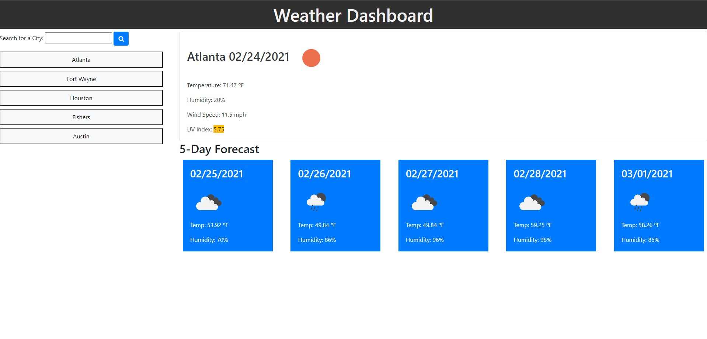

# Weather DashboardWork Day Scheduler 

## Purpose
Create a website where the user can search for a city's current weather and a 5-day forecast.

## Features
* The user can input a city and when the search button is clicked the current weather and 5-day forecast appear.
* When the user searches for a city the city is added to a button below for future searches.
* The UV index for today will be highlighted to let the user know if the conditions are favorable, moderate, or severe.
* When the city button is clicked in the search history then the current weather and 5-day forecast appear.

## Built With
* Bootstrap
* JavaScript
* HTML
* CSS

## Website
https://n8dogg59.github.io/weather/

## Gitbub Repository
https://github.com/n8dogg59/weather

## Screenshot

### Contribution
Created by Nate Schroeder